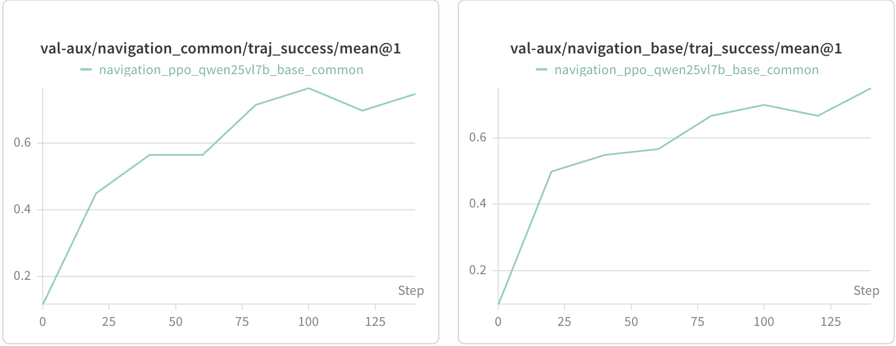

# Navigation Environment

Modified from [EmbodiedBench](https://github.com/EmbodiedBench/EmbodiedBench) navigation environment. The agent receives egocentric RGB images and follows natural language instructions to navigate to target locations.

## Installation

```bash
pip install ai2thor

# Refer to https://github.com/EmbodiedBench/EmbodiedBench, probably you also need:
sudo apt-get update && sudo apt-get -y install libvulkan1
sudo apt install vulkan-tools

```

AI2-THOR runs a Unity backend process per environment instance. It requires a GPU with cloud rendering support.


## Server

The navigation environment runs as a separate server (via `envs_remote` framework).

```bash
# Pre-download scene assets (recommended, avoids runtime downloads)
python -m vagen.envs.navigation.pre_download_scenes
# Auto-detect GPUs, default settings
python -m vagen.envs.navigation.serve

# Custom settings
python -m vagen.envs.navigation.serve --devices='[0,1]' --max_envs=64 --port=8001
```

Key parameters:
- `devices`: GPU IDs (default: auto-detect)
- `max_envs`: max alive environments, bounds GPU memory (default: 128)
- `thread_pool_size`: should be >= max_envs (default: 128)

## Evaluation

```bash
# Terminal 1: start server

# Terminal 2: run eval
bash examples/evaluate/navigation/run_eval.sh
```

Config: `examples/evaluate/navigation/config.yaml`

## Training

```bash
# Terminal 1: start server

# Terminal 2: run training
cd VAGEN
bash examples/train/navigation/train_ppo_qwen25vl7b.sh
```

## Performance



